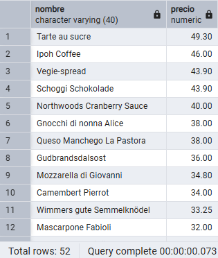
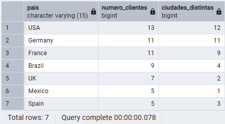
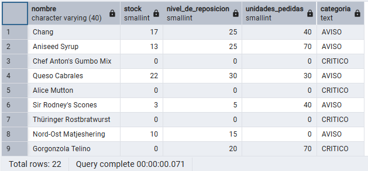
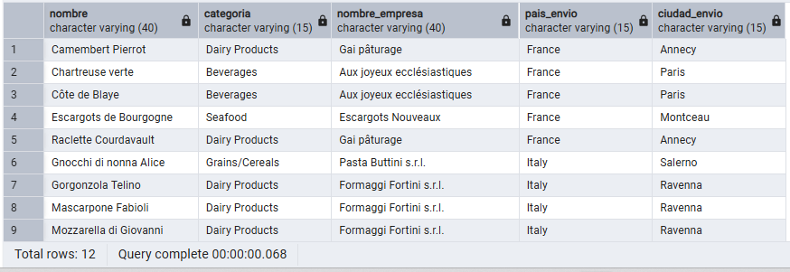
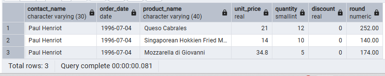
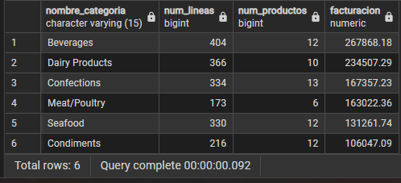
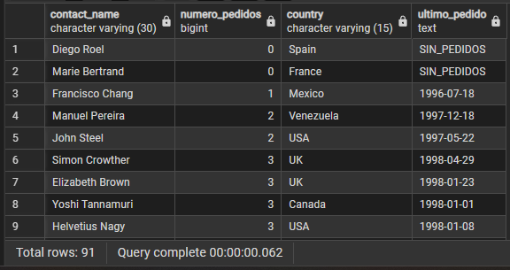
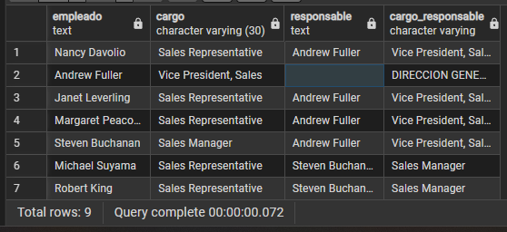

## Pregunta 01 — Catálogo comercial activo

**Enunciado:** Obtén los productos que no están descatalogados y cuyo precio unitario esté entre 10 y 50 euros, ambos incluidos. Muestra el nombre del producto y su precio redondeado a dos decimales, ordenado de mayor a menor precio.

**Consulta:**

```sql
select 
	product_name as nombre,
	ROUND(unit_price::NUMERIC ,2) as precio
from products
where 
	discontinued = 0 and 
	unit_price between 10 and 50
order by
	unit_price desc;
```

**Resultado:**



**Comentario:** He usado `NUMERIC` ya que la columna unit_price esta declarado como un numero real y `ROUND()` necesita de un `Numeric` o un `Decimal` si no el código no funcionaría.

## Pregunta 02 — Concentración geográfica de la cartera

**Enunciado:** Cuenta cuántos clientes hay en cada país y muestra únicamente aquellos países con 5 o más clientes, ordenados de mayor a menor. Indica también cuántas ciudades distintas hay en cada uno de esos países.

**Consulta:**

```sql
select 	
	country as pais,
	COUNT(country) as numero_clientes,
	COUNT(DISTINCT city) as ciudades_distintas
from customers
group by 
	country
having 
	COUNT(country) >= 5
order by 
	numero_clientes desc;
```

**Resultado:**



**Comentario:**  He agrupado los clientes por país para poder contar cuántos clientes hay en cada uno y cuántas ciudades distintas aparecen. He utilizado HAVING en lugar de WHERE porque necesito filtrar después de realizar el COUNT, mostrando únicamente los países que tienen al menos 5 clientes. Además, he ordenado el resultado de mayor a menor número de clientes para facilitar su comparación.

## Pregunta 03 — Alerta de reposición

**Enunciado:** Localiza los productos activos cuyas unidades en stock sean inferiores o iguales a su nivel de reposición. Muestra el nombre, las unidades en stock, el nivel de reposición, las unidades ya pedidas al proveedor y una columna de texto que indique `CRÍTICO` cuando el stock sea 0 y `AVISO` en el resto de casos.

**Consulta:**

```sql
SELECT 
	product_name as nombre,
	units_in_stock as stock,
	reorder_level as nivel_de_reposicion,
	units_on_order as unidades_pedidas,
	CASE WHEN
		units_in_stock = 0 THEN 'CRITICO'
		ELSE 'AVISO'
	END AS categoria
FROM products 
WHERE 
	units_in_stock <= reorder_level;
```

**Resultado:**



**Comentario:**  He utilizado WHERE para mostrar únicamente los productos cuyo stock actual es igual o inferior al nivel de reposición, ya que son los que necesitan atención. Además, he utilizado un CASE para diferenciar entre una situación crítica cuando no queda stock y un simple aviso cuando todavía quedan unidades disponibles. No sería necesario un JOIN porque toda la información que necesitamos se encuentra en la tabla products.

## Pregunta 04 — Ficha completa de producto

**Enunciado:** Para los productos suministrados por empresas de Italia, Francia o España, muestra el nombre del producto, el nombre de la categoría, el nombre del proveedor, su país y su ciudad. Ordena por país y, dentro de cada país, por nombre de producto.

**Consulta:**

```sql
SELECT 
	p.product_name as nombre,
	c.category_name as categoria,
	s.company_name as nombre_empresa,
	s.country as pais_envio,
	s.city as ciudad_envio
FROM products as p
	inner join categories as c on p.category_id = c.category_id
	inner join suppliers as s on p.supplier_id = s.supplier_id
where
	s.country in ('Spain','Italy','France')
order by s.country,p.product_name;
```

**Resultado:**



**Comentario:**  He utilizado dos INNER JOIN porque necesito relacionar cada producto con su categoría y con su proveedor, y solo me interesan los productos que tienen ambas relaciones. He filtrado los proveedores por país con WHERE para mostrar únicamente los de España, Italia y Francia, y he ordenado primero por país y después por nombre del producto para que el resultado quede agrupado y sea más fácil de consultar.

## Pregunta 05 — Detalle valorizado de un pedido

**Enunciado:** Muestra, para ese pedido, el nombre del producto, el precio unitario aplicado, la cantidad, el descuento y el importe final de cada línea. Añade el nombre del cliente y la fecha del pedido.

**Consulta:**

```sql
SELECT
	c.contact_name,
	o.order_date,
	p.product_name,
	p.unit_price,
	od.quantity,
	od.discount,
	ROUND((p.unit_price::numeric) * od.quantity * (1 - od.discount::numeric), 2)
FROM ORDERS AS O
	INNER JOIN ORDER_DETAILS AS OD ON OD.ORDER_ID = O.ORDER_ID
	INNER JOIN PRODUCTS AS P ON OD.PRODUCT_ID = P.PRODUCT_ID
	INNER join customers as c on c.customer_id = o.customer_id 
WHERE
	o.ORDER_ID = 10248;
```

**Resultado:**



**Comentario:**  He utilizado varios INNER JOIN porque necesito relacionar el pedido con sus detalles, los productos incluidos y el cliente que lo realizó, mostrando únicamente los registros que tienen relación entre estas tablas. He filtrado por el pedido 10248 para obtener solo sus productos y he calculado el importe aplicando el precio, la cantidad y el descuento, redondeándolo a dos decimales.

## Pregunta 06 — Ranking de categorías por facturación

**Enunciado:** Calcula la facturación total de cada categoría durante toda la historia de la compañía. Muestra el nombre de la categoría, el número de líneas de pedido que ha generado, el número de productos distintos vendidos y la facturación total. Incluye únicamente las categorías que superen los 100.000 euros de facturación, ordenadas de mayor a menor.

**Consulta:**

```sql
select 
	c.category_name as nombre_categoria,
	Count(p.product_id) as num_productos,
	round(sum((od.unit_price::numeric) * od.quantity * (1 - od.discount::numeric)), 2) as facturacion
from products as p
	inner join categories as c on p.category_id = c.category_id
	inner join ORDER_DETAILS AS OD ON OD.product_id = p.product_id
group by c.category_id
having sum((od.unit_price::numeric) * od.quantity * (1 - od.discount::numeric)) > 100000
order by facturacion desc;
```

**Resultado:**



**Comentario:**  He utilizado INNER JOIN para relacionar los productos con sus categorías y con los detalles de los pedidos, ya que solo necesitamos productos que hayan aparecido en algún pedido. He agrupado por categoría para calcular el número de productos y la facturación de cada una, utilizando HAVING para quedarme únicamente con las categorías que superan los 100.000 de facturación. Por último, he ordenado las categorías de mayor a menor facturación para comparar fácilmente los resultados.

## Pregunta 07 — Clientes sin actividad comercial

**Enunciado:** Lista todos los clientes con el número de pedidos que ha realizado cada uno y la fecha de su último pedido. Los clientes sin ningún pedido deben aparecer igualmente, con un 0 en el conteo y el texto 'SIN PEDIDOS' en lugar de la fecha. Ordena de forma que los clientes inactivos aparezcan primero.

**Consulta:**

```sql
SELECT
	C.CONTACT_NAME,
	COALESCE(COUNT(O.ORDER_ID)) AS NUMERO_PEDIDOS,
	C.COUNTRY,
	COALESCE(MAX(O.ORDER_DATE)::TEXT, 'SIN_PEDIDOS') AS ULTIMO_PEDIDO
FROM
	CUSTOMERS AS C
	LEFT JOIN ORDERS AS O ON C.CUSTOMER_ID = O.CUSTOMER_ID
GROUP BY
	C.CUSTOMER_ID,
	C.CONTACT_NAME
ORDER BY
	NUMERO_PEDIDOS ASC;
```

**Resultado:**



**Comentario:**  He utilizado un LEFT JOIN porque quiero mostrar todos los clientes, incluso aquellos que no hayan realizado ningún pedido, algo que no conseguiríamos con un INNER JOIN. He utilizado COALESCE para evitar valores nulos y mostrar SIN_PEDIDOS cuando un cliente no tiene pedidos, mientras que MAX permite obtener la fecha del último pedido realizado. Por último, he ordenado los clientes de menor a mayor número de pedidos.

## Pregunta 08 — Organigrama de la fuerza de ventas

**Enunciado:** Muestra cada empleado con su nombre completo, su cargo, el nombre completo de la persona a la que reporta y el cargo de esa persona. El empleado que no reporta a nadie debe aparecer también, con el texto 'DIRECCIÓN GENERAL' en el campo del responsable.

**Consulta:**

```sql
SELECT
	CONCAT(EMPL.FIRST_NAME, ' ', EMPL.LAST_NAME) AS EMPLEADO,
	EMPL.TITLE AS CARGO,
	COALESCE(CONCAT(JEFE.FIRST_NAME, ' ', JEFE.LAST_NAME),'DIRECCION GENERAL') AS RESPONSABLE,
	COALESCE(jefe.title, 'DIRECCION GENERAL') AS cargo_responsable
FROM
	EMPLOYEES AS EMPL
	LEFT JOIN EMPLOYEES AS JEFE ON EMPL.REPORTS_TO = JEFE.EMPLOYEE_ID;
```

**Resultado:**



**Comentario:**  He utilizado un LEFT JOIN de la tabla employees consigo misma porque cada empleado puede tener un responsable que también pertenece a la misma tabla. Se utiliza LEFT JOIN para que también aparezcan los empleados que no tienen responsable, y mediante COALESCE se muestra DIRECCION GENERAL en esos casos en lugar de dejar el valor vacío.
