## Pregunta 01 — Catálogo comercial activo

**Enunciado:** Obtén los productos que no están descatalogados y cuyo precio unitario esté entre 10 y 50 euros, ambos incluidos. Muestra el nombre del producto y su precio redondeado a dos decimales, ordenado de mayor a menor precio.

**Consulta:**

```sql
select 
	product_name as nombre,
	ROUND(unit_price::NUMERIC ,2) as precio
from products
where 
	discontinued = 0 and 
	unit_price between 10 and 50
order by
	unit_price desc;
```

**Resultado:**


**Comentario:** He usado `NUMERIC` ya que la columna unit_price esta declarado como un numero real y `ROUND()` necesita de un `Numeric` o un `Decimal` si no el código no funcionaría.

## Pregunta 02 — Concentración geográfica de la cartera

**Enunciado:** Cuenta cuántos clientes hay en cada país y muestra únicamente aquellos países con 5 o más clientes, ordenados de mayor a menor. Indica también cuántas ciudades distintas hay en cada uno de esos países.

**Consulta:**

```sql
select 	
	country as pais,
	COUNT(country) as numero_clientes,
	COUNT(DISTINCT city) as ciudades_distintas
from customers
group by 
	country
having 
	COUNT(country) >= 5
order by 
	numero_clientes desc;
```

**Resultado:**


**Comentario:**  He agrupado los clientes por país para poder contar cuántos clientes hay en cada uno y cuántas ciudades distintas aparecen. He utilizado HAVING en lugar de WHERE porque necesito filtrar después de realizar el COUNT, mostrando únicamente los países que tienen al menos 5 clientes. Además, he ordenado el resultado de mayor a menor número de clientes para facilitar su comparación.

## Pregunta 03 — Alerta de reposición

**Enunciado:** Localiza los productos activos cuyas unidades en stock sean inferiores o iguales a su nivel de reposición. Muestra el nombre, las unidades en stock, el nivel de reposición, las unidades ya pedidas al proveedor y una columna de texto que indique `CRÍTICO` cuando el stock sea 0 y `AVISO` en el resto de casos.

**Consulta:**

```sql
SELECT 
	product_name as nombre,
	units_in_stock as stock,
	reorder_level as nivel_de_reposicion,
	units_on_order as unidades_pedidas,
	CASE WHEN
		units_in_stock = 0 THEN 'CRITICO'
		ELSE 'AVISO'
	END AS categoria
FROM products 
WHERE 
	units_in_stock <= reorder_level;
```

**Resultado:**


**Comentario:**  He utilizado WHERE para mostrar únicamente los productos cuyo stock actual es igual o inferior al nivel de reposición, ya que son los que necesitan atención. Además, he utilizado un CASE para diferenciar entre una situación crítica cuando no queda stock y un simple aviso cuando todavía quedan unidades disponibles. No sería necesario un JOIN porque toda la información que necesitamos se encuentra en la tabla products.

## Pregunta 04 — Ficha completa de producto

**Enunciado:** Para los productos suministrados por empresas de Italia, Francia o España, muestra el nombre del producto, el nombre de la categoría, el nombre del proveedor, su país y su ciudad. Ordena por país y, dentro de cada país, por nombre de producto.

**Consulta:**

```sql
SELECT 
	p.product_name as nombre,
	c.category_name as categoria,
	s.company_name as nombre_empresa,
	s.country as pais_envio,
	s.city as ciudad_envio
FROM products as p
	inner join categories as c on p.category_id = c.category_id
	inner join suppliers as s on p.supplier_id = s.supplier_id
where
	s.country in ('Spain','Italy','France')
order by s.country,p.product_name;
```

**Resultado:**


**Comentario:**  He utilizado dos INNER JOIN porque necesito relacionar cada producto con su categoría y con su proveedor, y solo me interesan los productos que tienen ambas relaciones. He filtrado los proveedores por país con WHERE para mostrar únicamente los de España, Italia y Francia, y he ordenado primero por país y después por nombre del producto para que el resultado quede agrupado y sea más fácil de consultar.

## Pregunta 05 — Detalle valorizado de un pedido

**Enunciado:** Muestra, para ese pedido, el nombre del producto, el precio unitario aplicado, la cantidad, el descuento y el importe final de cada línea. Añade el nombre del cliente y la fecha del pedido.

**Consulta:**

```sql
SELECT
	c.contact_name,
	o.order_date,
	p.product_name,
	p.unit_price,
	od.quantity,
	od.discount,
	ROUND((p.unit_price::numeric) * od.quantity * (1 - od.discount::numeric), 2)
FROM ORDERS AS O
	INNER JOIN ORDER_DETAILS AS OD ON OD.ORDER_ID = O.ORDER_ID
	INNER JOIN PRODUCTS AS P ON OD.PRODUCT_ID = P.PRODUCT_ID
	INNER join customers as c on c.customer_id = o.customer_id 
WHERE
	o.ORDER_ID = 10248;
```

**Resultado:**


**Comentario:**  He utilizado varios INNER JOIN porque necesito relacionar el pedido con sus detalles, los productos incluidos y el cliente que lo realizó, mostrando únicamente los registros que tienen relación entre estas tablas. He filtrado por el pedido 10248 para obtener solo sus productos y he calculado el importe aplicando el precio, la cantidad y el descuento, redondeándolo a dos decimales.

## Pregunta 06 — Ranking de categorías por facturación

**Enunciado:** Calcula la facturación total de cada categoría durante toda la historia de la compañía. Muestra el nombre de la categoría, el número de líneas de pedido que ha generado, el número de productos distintos vendidos y la facturación total. Incluye únicamente las categorías que superen los 100.000 euros de facturación, ordenadas de mayor a menor.

**Consulta:**

```sql
select 
	c.category_name as nombre_categoria,
	Count(p.product_id) as num_productos,
	round(sum((od.unit_price::numeric) * od.quantity * (1 - od.discount::numeric)), 2) as facturacion
from products as p
	inner join categories as c on p.category_id = c.category_id
	inner join ORDER_DETAILS AS OD ON OD.product_id = p.product_id
group by c.category_id
having sum((od.unit_price::numeric) * od.quantity * (1 - od.discount::numeric)) > 100000
order by facturacion desc;
```

**Resultado:**


**Comentario:**  He utilizado INNER JOIN para relacionar los productos con sus categorías y con los detalles de los pedidos, ya que solo necesitamos productos que hayan aparecido en algún pedido. He agrupado por categoría para calcular el número de productos y la facturación de cada una, utilizando HAVING para quedarme únicamente con las categorías que superan los 100.000 de facturación. Por último, he ordenado las categorías de mayor a menor facturación para comparar fácilmente los resultados.

## Pregunta 07 — Clientes sin actividad comercial

**Enunciado:** Lista todos los clientes con el número de pedidos que ha realizado cada uno y la fecha de su último pedido. Los clientes sin ningún pedido deben aparecer igualmente, con un 0 en el conteo y el texto 'SIN PEDIDOS' en lugar de la fecha. Ordena de forma que los clientes inactivos aparezcan primero.

**Consulta:**

```sql
SELECT
	C.CONTACT_NAME,
	COALESCE(COUNT(O.ORDER_ID)) AS NUMERO_PEDIDOS,
	C.COUNTRY,
	COALESCE(MAX(O.ORDER_DATE)::TEXT, 'SIN_PEDIDOS') AS ULTIMO_PEDIDO
FROM
	CUSTOMERS AS C
	LEFT JOIN ORDERS AS O ON C.CUSTOMER_ID = O.CUSTOMER_ID
GROUP BY
	C.CUSTOMER_ID,
	C.CONTACT_NAME
ORDER BY
	NUMERO_PEDIDOS ASC;
```

**Resultado:**


**Comentario:**  He utilizado un LEFT JOIN porque quiero mostrar todos los clientes, incluso aquellos que no hayan realizado ningún pedido, algo que no conseguiríamos con un INNER JOIN. He utilizado COALESCE para evitar valores nulos y mostrar SIN_PEDIDOS cuando un cliente no tiene pedidos, mientras que MAX permite obtener la fecha del último pedido realizado. Por último, he ordenado los clientes de menor a mayor número de pedidos.

## Pregunta 08 — Organigrama de la fuerza de ventas

**Enunciado:** Muestra cada empleado con su nombre completo, su cargo, el nombre completo de la persona a la que reporta y el cargo de esa persona. El empleado que no reporta a nadie debe aparecer también, con el texto 'DIRECCIÓN GENERAL' en el campo del responsable.

**Consulta:**

```sql
SELECT
	CONCAT(EMPL.FIRST_NAME, ' ', EMPL.LAST_NAME) AS EMPLEADO,
	EMPL.TITLE AS CARGO,
	COALESCE(CONCAT(JEFE.FIRST_NAME, ' ', JEFE.LAST_NAME),'DIRECCION GENERAL') AS RESPONSABLE,
	COALESCE(jefe.title, 'DIRECCION GENERAL') AS cargo_responsable
FROM
	EMPLOYEES AS EMPL
	LEFT JOIN EMPLOYEES AS JEFE ON EMPL.REPORTS_TO = JEFE.EMPLOYEE_ID;
```

**Resultado:**


**Comentario:**  He utilizado un LEFT JOIN de la tabla employees consigo misma porque cada empleado puede tener un responsable que también pertenece a la misma tabla. Se utiliza LEFT JOIN para que también aparezcan los empleados que no tienen responsable, y mediante COALESCE se muestra DIRECCION GENERAL en esos casos en lugar de dejar el valor vacío.

## Pregunta 09 — Rejilla de cobertura categoría × año 

**Enunciado:** Control de gestión quiere una rejilla completa de facturación por categoría y año, **sin huecos**: si una categoría no vendió nada en un año concreto, debe aparecer con un 0, no desaparecer de la tabla.
Genera todas las combinaciones posibles de las 8 categorías con los 3 años del histórico (24 filas) y asocia a cada combinación su facturación. Ordena por categoría y año.

**Consulta:**

```sql
SELECT cat.category_name AS categoria,
       anios.anio,
       COALESCE(ROUND(SUM((od.unit_price::numeric) * od.quantity * (1 - od.discount::numeric)), 2), 0) AS facturacion
FROM categories cat
CROSS JOIN (
    SELECT DISTINCT EXTRACT(YEAR FROM order_date)::int AS anio 
    FROM orders
) anios
LEFT JOIN products p ON cat.category_id = p.category_id
LEFT JOIN order_details od ON p.product_id = od.product_id
LEFT JOIN orders o ON od.order_id = o.order_id AND EXTRACT(YEAR FROM o.order_date) = anios.anio
GROUP BY cat.category_name, anios.anio
ORDER BY cat.category_name ASC, anios.anio ASC;
```
**Resultado:**

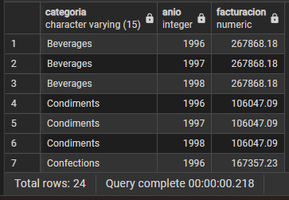

**Comentario:**  

He utilizado un CROSS JOIN con los años para garantizar que aparezcan todas las categorías en cada periodo, combinándolo con LEFT JOIN y COALESCE para mostrar un 0 en lugar de nulos cuando no hay ventas. Asimismo, se emplea el casteo a numeric, el cálculo de descuentos y ROUND para asegurar una precisión monetaria exacta en la facturación total.

## Pregunta 10 - Mapa de países: clientes frente a proveedores

**Enunciado:** 

Expansión internacional quiere una única tabla que muestre, para cada país en el que la compañía tiene presencia, cuántos clientes y cuántos proveedores hay. Deben aparecer los países que solo tienen clientes, los que solo tienen proveedores y los que tienen ambos.

**Consulta:**

```sql
SELECT COALESCE(c.country, s.country) AS pais,
       COALESCE(c.num_clientes, 0) AS num_clientes,
       COALESCE(s.num_proveedores, 0) AS num_proveedores,
       CASE 
           WHEN c.country IS NOT NULL AND s.country IS NOT NULL THEN 'AMBOS'
           WHEN c.country IS NOT NULL THEN 'SOLO CLIENTES'
           ELSE 'SOLO PROVEEDORES'
       END AS tipo_presencia
FROM (
    SELECT country, COUNT(*) AS num_clientes 
    FROM customers 
    GROUP BY country
) c
FULL OUTER JOIN (
    SELECT country, COUNT(*) AS num_proveedores 
    FROM suppliers 
    GROUP BY country
) s ON c.country = s.country
ORDER BY pais ASC;
```

**Resultado:**

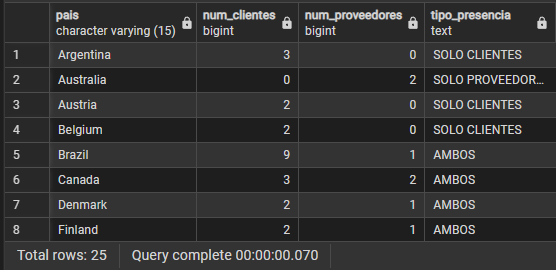

**Comentario:**  

Se emplea un FULL OUTER JOIN entre las subconsultas agrupadas de clientes y proveedores para unificar todos los países sin perder aquellos que solo existan en una tabla. Además, se utiliza COALESCE para gestionar los nombres de los países y reemplazar los recuentos vacíos por ceros, mientras que el bloque CASE clasifica automáticamente el tipo de presencia comercial en cada territorio.

## Pregunta 11 - Directorio unificado de contactos

**Enunciado:** 

Sistemas va a migrar el CRM y necesita una exportación única con todos los contactos de la compañía, vengan de donde vengan.
Construye una sola tabla que reúna los contactos de clientes, los de proveedores y los empleados. Cada fila debe indicar el origen (`'CLIENTE'`, `'PROVEEDOR'`, `'EMPLEADO'`), el nombre de la persona de contacto **en mayúsculas**, la organización a la que pertenece, la ciudad y el país. Para los empleados, la organización es el literal `'NORTHWIND TRADERS'` y el nombre de contacto se forma concatenando nombre y apellidos.
Ordena por origen y luego por país.

**Consulta:**

```sql
SELECT 'CLIENTE' AS origen,
       UPPER(contact_name) AS contacto,
       company_name AS organizacion,
       city AS ciudad,
       country AS pais
FROM customers

UNION ALL

SELECT 'PROVEEDOR' AS origen,
       UPPER(contact_name) AS contacto,
       company_name AS organizacion,
       city AS ciudad,
       country AS pais
FROM suppliers

UNION ALL

SELECT 'EMPLEADO' AS origen,
       UPPER(first_name || ' ' || last_name) AS contacto,
       'NORTHWIND TRADERS' AS organizacion,
       city AS ciudad,
       country AS pais
FROM employees
ORDER BY origen ASC, pais ASC;
```

**Resultado:**

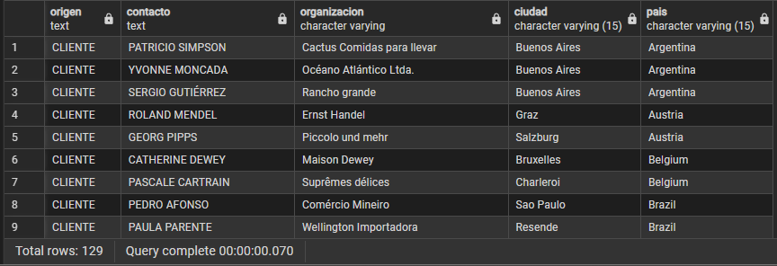

**Comentario:**  

Se utiliza UNION ALL para combinar de forma eficiente y sin filtrar duplicados los registros de clientes, proveedores y empleados en un único listado homogéneo. Cada bloque asigna una etiqueta de origen mediante literales ('CLIENTE', 'PROVEEDOR', 'EMPLEADO'), estandariza los nombres a mayúsculas —concatenando el nombre y apellido para los empleados— y unifica la estructura de columnas para ordenar finalmente el resultado por origen y país.

## Pregunta 12 - Mercados con desequilibrio

**Enunciado:** 

Compras y Ventas mantienen una discusión recurrente: ¿en qué países vendemos sin tener proveedor local, y en cuáles coincidimos?
Resuelve las dos preguntas en dos consultas independientes:
- Países donde hay clientes pero **ningún** proveedor.
- Países donde hay **a la vez** clientes y proveedores.
Ordena ambos resultados alfabéticamente.

**Consulta:**

```sql
SELECT country AS pais FROM customers
EXCEPT
SELECT country FROM suppliers
ORDER BY pais ASC;


SELECT country AS pais FROM customers
INTERSECT
SELECT country FROM suppliers
ORDER BY pais ASC;
```

**Resultado:**

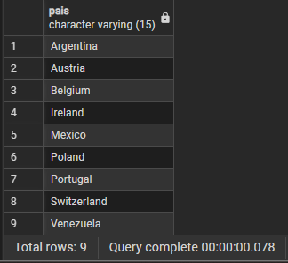
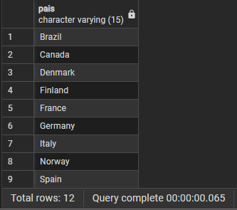

**Comentario:** 

Comentario apartado A

Se emplea el operador EXCEPT para identificar y aislar aquellos países que tienen clientes registrados pero que no cuentan con ningún proveedor asociado. De este modo, se eliminan las coincidencias de ambas tablas para obtener una lista exclusiva de mercados con clientes únicos, ordenando finalmente el resultado de forma alfabética.

Comentario apartado B

Se emplea el operador INTERSECT para identificar y mostrar únicamente aquellos países que tienen presencia tanto en la tabla de clientes como en la de proveedores. De este modo, se obtienen las coincidencias comunes de ambos conjuntos de datos, ordenando finalmente el resultado de forma alfabética por el nombre del país.

## Pregunta 13 - Clientes que nunca han comprado pescado

**Enunciado:** 

El responsable de la categoría Seafood quiere una lista de cuentas sobre las que hacer campaña de captación.
Localiza los clientes que **nunca** han incluido un producto de la categoría `'Seafood'` en ninguno de sus pedidos. Muestra el nombre del cliente, su país y el número total de pedidos que sí ha realizado, de mayor a menor.

**Consulta:**

```sql
SELECT c.company_name AS cliente,
       c.country AS pais,
       COUNT(o.order_id) AS pedidos_realizados
FROM customers c
LEFT JOIN orders o ON c.customer_id = o.customer_id
WHERE NOT EXISTS (
    SELECT 1
    FROM orders o2
    INNER JOIN order_details od ON o2.order_id = od.order_id
    INNER JOIN products p ON od.product_id = p.product_id
    INNER JOIN categories cat ON p.category_id = cat.category_id
    WHERE o2.customer_id = c.customer_id
      AND cat.category_name = 'Seafood'
)
GROUP BY c.company_name, c.country
ORDER BY pedidos_realizados DESC;
```

**Resultado:**

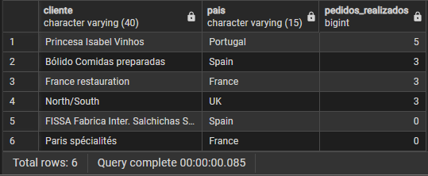

**Comentario:** 

Se emplea un LEFT JOIN junto con un recuento (COUNT) para listar a todos los clientes y su número total de pedidos, utilizando además la cláusula NOT EXISTS con una subconsulta correlacionada para excluir rigurosamente a aquellos clientes que hayan comprado productos de la categoría 'Seafood'. Finalmente, se agrupan los datos por cliente y país, ordenando el resultado de mayor a menor según la cantidad de pedidos realizados.

## Pregunta 14 - Productos por encima de la media

**Enunciado:** 

El comité de precios quiere identificar el segmento premium del catálogo.
Muestra los productos activos cuyo precio unitario supere el precio medio de **todo** el catálogo. Incluye en cada fila el precio del producto, el precio medio general y la diferencia entre ambos, todo redondeado a dos decimales. Ordena por diferencia descendente.

**Consulta:**

```sql
SELECT product_name AS producto,
       ROUND(unit_price::numeric, 2) AS precio,
       ROUND((SELECT AVG(unit_price::numeric) FROM products WHERE discontinued = 0), 2) AS precio_medio_catalogo,
       ROUND(unit_price::numeric - (SELECT AVG(unit_price::numeric) FROM products WHERE discontinued = 0), 2) AS diferencia
FROM products
WHERE discontinued = 0
  AND unit_price > (SELECT AVG(unit_price::numeric) FROM products WHERE discontinued = 0)
ORDER BY diferencia DESC;
```
**Resultado:**

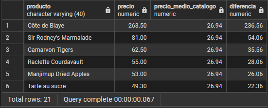

**Comentario:**  

Se emplean subconsultas escalares para calcular de forma dinámica el precio medio de los productos activos, filtrando el catálogo para mostrar únicamente aquellos artículos cuyo precio supera dicha media. Asimismo, se utiliza el casteo a numeric junto con ROUND para asegurar la precisión decimal al calcular la diferencia exacta de cada producto frente al promedio, ordenando finalmente el resultado de mayor a menor según este margen.

## Pregunta 15 - Ticket medio por cliente

**Enunciado:** 

Dirección comercial quiere segmentar la cartera por valor medio de pedido, no por volumen total.
Calcula, para cada cliente que haya comprado alguna vez, el número de pedidos, el importe total acumulado y el importe medio por pedido. Muestra los 15 clientes con mayor ticket medio.
El cálculo tiene dos niveles: primero hay que obtener el importe de cada pedido sumando sus líneas, y solo después promediar esos importes por cliente. **Promediar directamente las líneas daría un resultado distinto y equivocado.**

**Consulta:**

```sql
SELECT c.company_name AS cliente,
       c.country AS pais,
       COUNT(t.order_id) AS num_pedidos,
       ROUND(SUM(t.importe_pedido), 2) AS importe_total,
       ROUND(AVG(t.importe_pedido), 2) AS ticket_medio
FROM customers c
INNER JOIN (
    SELECT order_id,
           customer_id,
           SUM((unit_price::numeric) * quantity * (1 - discount::numeric)) AS importe_pedido
    FROM order_details
    INNER JOIN orders USING (order_id)
    GROUP BY order_id, customer_id
) t ON c.customer_id = t.customer_id
GROUP BY c.company_name, c.country
ORDER BY ticket_medio DESC
LIMIT 15;
```

**Resultado:**

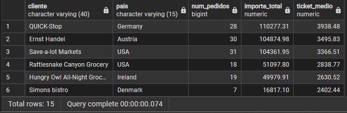

**Comentario:** 

Se utiliza una subconsulta previa para calcular el importe monetario exacto de cada pedido individual aplicando descuentos y conversiones a numeric, permitiendo cruzarla posteriormente con la tabla de clientes. Esto facilita la agregación final para calcular de forma limpia el número de pedidos, la facturación total y el ticket medio por cada cliente, ordenando los resultados de mayor a menor para aislar los 15 principales.

## Pregunta 16 - El producto más caro de cada categoría

**Enunciado:** 

El equipo de compras quiere revisar el posicionamiento de precio en cada familia.
Para cada categoría, muestra el producto con el precio unitario más alto. Incluye el nombre de la categoría, el nombre del producto, su precio y el precio medio de su categoría.
Resuélvelo con una **subconsulta correlacionada**: para cada producto, comprueba si su precio coincide con el máximo de su propia categoría.

**Consulta:**

```sql
SELECT c.category_name AS categoria,
       p.product_name AS producto,
       ROUND(p.unit_price::numeric, 2) AS precio,
       ROUND((
           SELECT AVG(p_avg.unit_price::numeric)
           FROM products p_avg
           WHERE p_avg.category_id = p.category_id
       ), 2) AS precio_medio_categoria
FROM products p
INNER JOIN categories c ON p.category_id = c.category_id
WHERE p.unit_price = (
    SELECT MAX(p_max.unit_price)
    FROM products p_max
    WHERE p_max.category_id = p.category_id
)
ORDER BY c.category_name ASC;
```

**Resultado:**

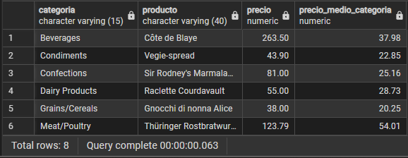

**Comentario:**  

Se emplea una subconsulta correlacionada en el filtro WHERE junto con la función MAX para aislar y mostrar únicamente el producto más caro de cada categoría. Asimismo, se utiliza otra subconsulta escalar correlacionada para calcular de forma dinámica el precio medio específico de esa misma categoría, aplicando un casteo a numeric y ROUND para mantener la precisión decimal. Finalmente, se cruzan las tablas con un INNER JOIN y se ordena alfabéticamente el resultado por el nombre de la categoría.

## Pregunta 17 - Segmentación ABC de la cartera de clientes

**Enunciado:** 

Dirección quiere clasificar a los clientes en tres tramos de valor para asignar recursos comerciales.
Usando expresiones de tabla común (CTE), construye una consulta que:

1. Calcule la facturación total de cada cliente.
2. Divida los clientes en **cuartiles** según esa facturación.
3. Asigne una etiqueta de segmento: `'A - Estratégico'` al cuartil superior, `'B - Consolidado'` al segundo, `'C - Ocasional'` al tercero y `'D - Marginal'` al cuarto.
4. Devuelva, por segmento, el número de clientes, la facturación total del segmento y el porcentaje que representa sobre el total de la compañía.
   
**Consulta:**

```sql
WITH facturacion_cliente AS (
    SELECT o.customer_id,
           SUM((od.unit_price::numeric) * od.quantity * (1 - od.discount::numeric)) AS facturacion
    FROM orders o
    INNER JOIN order_details od ON o.order_id = od.order_id
    GROUP BY o.customer_id
),
segmentacion AS (
    SELECT customer_id,
           facturacion,
           NTILE(4) OVER (ORDER BY facturacion DESC) AS cuartil
    FROM facturacion_cliente
),
etiquetado AS (
    SELECT customer_id,
           facturacion,
           CASE cuartil
               WHEN 1 THEN 'A - Estratégico'
               WHEN 2 THEN 'B - Consolidado'
               WHEN 3 THEN 'C - Ocasional'
               WHEN 4 THEN 'D - Marginal'
           END AS segmento
    FROM segmentacion
)
SELECT segmento,
       COUNT(*) AS num_clientes,
       ROUND(SUM(facturacion), 2) AS facturacion_segmento,
       ROUND((SUM(facturacion) / (SELECT SUM(facturacion) FROM facturacion_cliente) * 100), 2) AS porcentaje_sobre_total
FROM etiquetado
GROUP BY segmento
ORDER BY facturacion_segmento DESC;
```

**Resultado:**

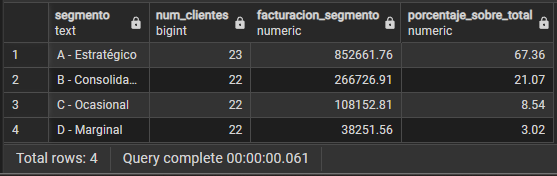

**Comentario:**  

Se emplean expresiones de tabla comunes para estructurar la lógica por fases, utilizando la función de ventana NTILE(4) para dividir a los clientes en cuatro cuartiles según su facturación. Asimismo, se usa una sentencia CASE para asignar etiquetas cualitativas a cada segmento y se calcula el porcentaje de contribución de cada grupo respecto al total general mediante una subconsulta escalar, agrupando y ordenando finalmente los resultados por la facturación del segmento.

## Pregunta 18 - Los tres productos más vendidos de cada categoría

**Enunciado:** 

El equipo de categoría necesita el podio de cada familia para negociar con proveedores.
Para cada categoría, obtén los **tres productos con mayor facturación**. Muestra la categoría, la posición dentro de la categoría, el nombre del producto, las unidades vendidas y la facturación.
Incluye además una columna con la posición global del producto en el conjunto de la compañía, para que se vea qué productos son líderes de su nicho pero irrelevantes en el total.

**Consulta:**

```sql
WITH ventas_producto AS (
    SELECT p.category_id,
           p.product_id,
           p.product_name AS producto,
           SUM(od.quantity) AS unidades,
           ROUND(SUM((od.unit_price::numeric) * od.quantity * (1 - od.discount::numeric)), 2) AS facturacion
    FROM products p
    INNER JOIN order_details od ON p.product_id = od.product_id
    GROUP BY p.category_id, p.product_id, p.product_name
),
rankings AS (
    SELECT vp.*,
           DENSE_RANK() OVER (PARTITION BY vp.category_id ORDER BY vp.facturacion DESC) AS posicion_en_categoria,
           DENSE_RANK() OVER (ORDER BY vp.facturacion DESC) AS posicion_global
    FROM ventas_producto vp
)
SELECT c.category_name AS categoria,
       r.posicion_en_categoria,
       r.producto,
       r.unidades,
       r.facturacion,
       r.posicion_global
FROM rankings r
INNER JOIN categories c ON r.category_id = c.category_id
WHERE r.posicion_en_categoria <= 3
ORDER BY c.category_name ASC, r.posicion_en_categoria ASC;
```
**Resultado:**

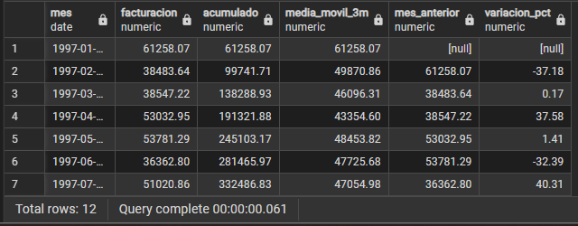

**Comentario:** 

Se estructuran expresiones de tabla comunes (para agrupar ventas y facturación por producto, aplicando posteriormente la función de ventana DENSE_RANK() para calcular de forma simultánea su posición interna por categoría y su ranking global. Por último, se cruza la información con la tabla de categorías y se filtra para mostrar exclusivamente el podio (top 3) de cada grupo, ordenando los resultados alfabéticamente por categoría y de forma ascendente por su puesto.

## Pregunta 19 - Evolución mensual con acumulado y media móvil

**Enunciado:** 

Control de gestión prepara el cuadro de mando de la evolución del negocio durante 1997.
Para cada mes de 1997, calcula:

- La facturación del mes.
- El total acumulado desde enero.
- La media móvil de los tres últimos meses (el mes actual y los dos anteriores).
- La facturación del mes anterior.
- La variación porcentual respecto al mes anterior.
  
**Consulta:**

```sql
WITH ventas_1997 AS (
    SELECT DATE_TRUNC('month', o.order_date)::date AS mes,
           ROUND(SUM((od.unit_price::numeric) * od.quantity * (1 - od.discount::numeric)), 2) AS facturacion
    FROM orders o
    INNER JOIN order_details od ON o.order_id = od.order_id
    WHERE o.order_date >= '1997-01-01' AND o.order_date < '1998-01-01'
    GROUP BY DATE_TRUNC('month', o.order_date)::date
)
SELECT mes,
       facturacion,
       SUM(facturacion) OVER (
           ORDER BY mes
       ) AS acumulado,
       ROUND(AVG(facturacion) OVER (
           ORDER BY mes 
           ROWS BETWEEN 2 PRECEDING AND CURRENT ROW
       ), 2) AS media_movil_3m,
       LAG(facturacion) OVER (
           ORDER BY mes
       ) AS mes_anterior,
       ROUND(((facturacion - LAG(facturacion) OVER (ORDER BY mes)) / LAG(facturacion) OVER (ORDER BY mes) * 100), 2) AS variacion_pct
FROM ventas_1997
ORDER BY mes ASC;
```
**Resultado:**


**Comentario:**  

Se emplea una expresión de tabla común (CTE) para agrupar la facturación mensual de 1997 con cálculos monetarios precisos, sobre la cual se aplican funciones de ventana para calcular un acumulado progresivo, una media móvil trimestral y la función LAG para determinar la variación porcentual mes a mes. Finalmente, los datos se ordenan cronológicamente para facilitar el análisis de la evolución temporal de las ventas.

## Pregunta 20 - Cuadro de mando anual por categoría

**Enunciado:** 

Última petición, y la más ambiciosa: el informe anual que se presenta al consejo.
Construye una tabla donde cada fila sea una categoría y las columnas muestren la facturación de 1996, 1997 y 1998 en columnas separadas, más el total de los tres años. Añade al final una fila de totales generales.
Incluye además una columna que indique el peso de cada categoría sobre la facturación total de la compañía, y otra que muestre si la categoría creció o decreció entre 1997 y 1998.

**Consulta:**
```sql
WITH ventas_base AS (
    SELECT c.category_name,
           ROUND(SUM((od.unit_price::numeric) * od.quantity * (1 - od.discount::numeric)) 
                 FILTER (WHERE EXTRACT(YEAR FROM o.order_date) = 1996), 2) AS f_1996,
           ROUND(SUM((od.unit_price::numeric) * od.quantity * (1 - od.discount::numeric)) 
                 FILTER (WHERE EXTRACT(YEAR FROM o.order_date) = 1997), 2) AS f_1997,
           ROUND(SUM((od.unit_price::numeric) * od.quantity * (1 - od.discount::numeric)) 
                 FILTER (WHERE EXTRACT(YEAR FROM o.order_date) = 1998), 2) AS f_1998,
           ROUND(SUM((od.unit_price::numeric) * od.quantity * (1 - od.discount::numeric)), 2) AS total
    FROM categories c
    INNER JOIN products p ON c.category_id = p.category_id
    INNER JOIN order_details od ON p.product_id = od.product_id
    INNER JOIN orders o ON od.order_id = o.order_id
    GROUP BY ROLLUP(c.category_name)
)
SELECT COALESCE(category_name, 'TOTAL GENERAL') AS categoria,
       COALESCE(f_1996, 0) AS f_1996,
       COALESCE(f_1997, 0) AS f_1997,
       COALESCE(f_1998, 0) AS f_1998,
       total,
       ROUND((total / (SELECT total FROM ventas_base WHERE category_name IS NULL) * 100), 2) AS peso_pct,
       CASE 
           WHEN category_name IS NULL THEN 'N/A'
           WHEN f_1998 > f_1997 THEN 'CRECE'
           ELSE 'DECRECE'
       END AS tendencia
FROM ventas_base
ORDER BY (category_name IS NULL) ASC, total DESC;
```
**Resultado:**

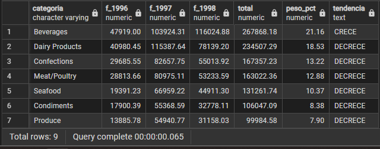

**Comentario:** 

Se utiliza una expresión de tabla común para filtrar y agrupar la facturación mensual del año 1997 aplicando cálculos monetarios precisos con descuentos. A continuación, se emplean funciones de ventana para calcular un acumulado anual progresivo, una media móvil de tres meses para suavizar la tendencia estacional, y la función LAG junto con operaciones aritméticas para determinar la variación porcentual mes a mes. Finalmente, se ordenan los resultados de forma cronológica para facilitar el análisis temporal de las ventas.
